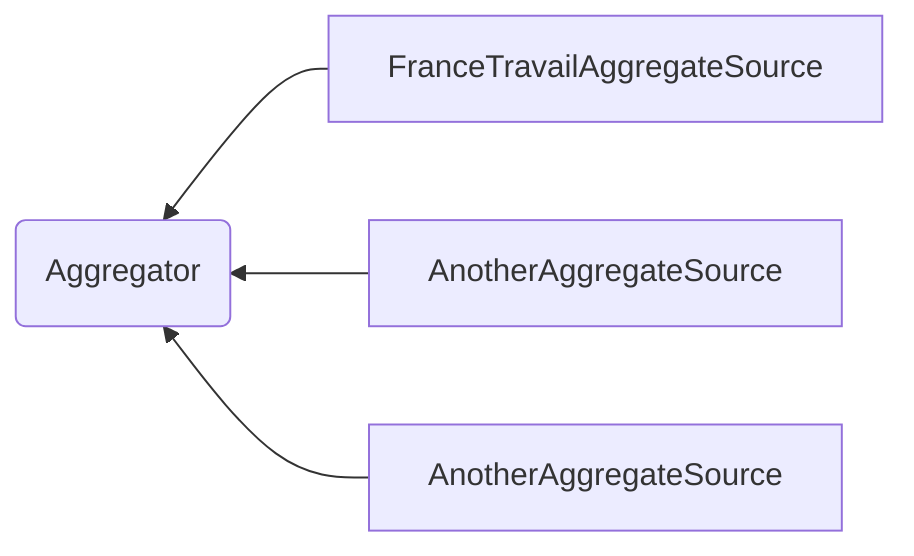
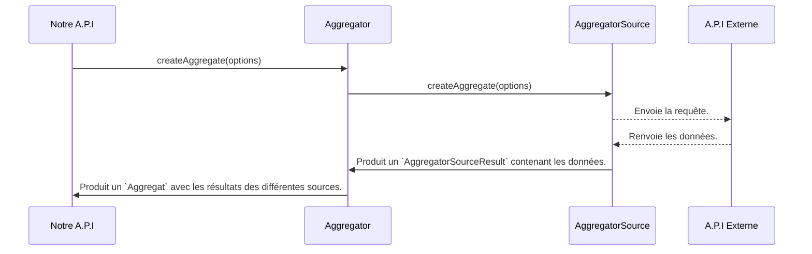

# Note d'intention

> [!TIP]
> Cette note a pour vocation de rassembler la reflexion qui a mené au code écrit.

## Réflexion préliminaire

Suite à la lecture du sujet, voici les grandes problématiques métier extraites :

1. Créer un outil qui permet de récupérer les entreprises qui recrutent.
2. Créer un système d'aggrégation de plateforme qui se doit être évolutif (*...le développement d’un outil de
   centralisation de **ces différentes plateformes**...*) car susceptible
   d'avoir plusieurs sources.
3. Intégrer une première source externe via l'A.P.I de FranceTravail "La Bonne Boite".
4. Mettre en place un système qui limite le nombre d'appel par utilisateur.

## Approche du système d'aggregation

Le but du système est de fournir une manière de récupérer les entreprises susceptibles de recruter depuis plusieurs
sources. Chaque source répond à ses propres
contraintes (authentification par exemple), et fournit son propre schema de donnée.

L'objectif a donc été de créer un système qui unifie la manière dont les sources fournissent les données des entreprise
à notre système,
en permet aussi de rajouter des sources au fur et à mesure sans avoir à modifier le
système initial.
Pour cela, notre système se repose sur deux éléments permettant l'abstraction et
la normalisation : Un `Aggregator` qui a pour but de collecter des entités depuis des `AggregatorSource`.
Les `AggregatorSource` ont pour objectif
de fournir une version normalisée des entreprises récupérées depuis leur propre A.P.I. externe.

**Dépendance entre `Aggregator` et `AggregatorSource` :**

Lorsque l'on souhaite créer un aggrégat, on appelle la methode `createAggregate()` de l'`Aggregator`et celui-ci se
charge en interne de récupérer les éléments depuis les
sources.

**Création d'un `Aggregat` :**

#### Problématiques rencontrées :

> **Que faire si une source lève une erreur lors de la récupération des entités ?**

Dans cette configuration, les `AggregatorSource` échoue en silence en retournant un `AggregateSourceInvalidResult` qui
explique les raisons de l'échec. Néanmoins, si toutes les sources échouent alors l'`Aggregator` léve une
erreur `NoValidAggregationSourceResultError`. Il est à la charge du reste
du code de gérer l'erreur. *Une piste d'amélioration serait de pouvoir configurer l'`Aggregator` lors de sa création en
lui indiquant le comportement attendu
en cas de problème interne.*

> **Comment prendre en compte les problématiques de rate limit sur les API externe ?**

Pour différentes raisons, certaines sources peuvent ne pas être disponibles ou produiront une erreur à coup sûr (par
exemple une A.P.I avec un rateLimit).
Pour éviter les appels inutiles chaque source indique si ells est prête avant l'appel (`AggregatorSource.isReady()`).

#### Pistes d'amélioration :

- Mettre en place un système de cache dans les sources pour éviter les appels qui peuvent être redondants et prévenir
  d'une propagation d'un DDOS de notre A.P.I. vers celles des partenaires.
- Mettre en place un système de configuration pour notre `Aggregator`.

## Integration de l'A.P.I. de Francetravail.io

L'A.P.I **La Bonne Boite** est un producteur de donnée pour notre A.P.I. Son integration a posé deux problèmiques à
résoudre :

1. Les appels doivent être authentifiés et sont limités à 1 appel par second.
2. Les paramètres de la requête correspondent à des éléments "metier" de FranceTravail (`rome_code` et `commune_id`) et
   peuvent ne pas être explicite pour une personne lambda qui utiliserait notre plateforme.

#### Authentification Francetravail.io :

Pour résoudre ce problème chaque appel à L'A.P.I **La Bonne Boite** récupère en amont un token (Bearer dans notre cas)
via la class `FranceTravailAuthenticator`.
De plus cette class est en mesure, selon les options utilisées lors de sa création, de récupérer automatiquement un
nouveau
token dès que le précédent est périmé.
Cela nous permet d'éviter d'attendre une première requête avant de pouvoir interroger l'A.P.I. **La Bonne Boite**.

#### Rendre l'utilisation de Francetravail.io plus "User friendly".

En imaginant un système qui prendrait les informations dans différentes sources, il parait plus adaptée que les requêtes
s'effectue
non pas sur des codes ROME ou des communes ID de l'INSEE, mais sur des termes plus utilisés par le grand public.
Il a donc fallu trouver un moyen de faire correspondre les codes communes INSEE avec les noms de ville + code postal, et
des noms de métier avec les codes ROME.

###### Code ROME

France travail fournit des jeux de données sur la plateforme data.gouv.fr
pour [les codes ROME](https://www.data.gouv.fr/fr/datasets/repertoire-operationnel-des-metiers-et-des-emplois-rome/).
Dans le dataset du 3 novembre 2021 (8cf674b6-ef21-446a-8190-178e2defd6fc) au format C.S.V. est mis à disposition un
fichier (unix_referentiel_appellation_v455_utf8.csv) qui permet de faire correspondre des appellations de métier avec
des codes ROME.

À partir de ce fichier, il est alors possible de faire des recherches sur des termes plus génériques. Pour permettre une
recherche éfficiente et moins coûteuse en ressource que celui de charger les données en mémoire à chaque requête à
l'A.P.I., le choix s'est porté sur une intégration de ces données dans une base de donnée Postgres. *Il a été admis que
pour ce genre de projet, une
base de donnée serait de toute manière requise pour le reste de l'application.*
L'avantage est double : Une vitesse d'exécution de la recherche plus rapide, et la
possibilité de bénéficier des recherches `LIKE %%` du SQL
et du format de colonne `citext`.
Le coût de cette approche a été de penser un système qui permet de remplir au préalable la base de donnée, mais aussi de
suivre les modifications du fichier sources (ajout ou suppression de donnée).

**Cette même solution a été utilisée pour les codes postaux et nom de ville.**

###### Code postal + ville

Prérequis de cet exercice, une première piste était déjà fournie dans
l'énoncé (https://www.insee.fr/fr/information/2114819), puis confirmer par Kevin par mail avec le lien vers la
plateforme data.gouv.fr.
Comme pour les codes ROME, le choix s'est porté sur une intégration en base de donnée.
